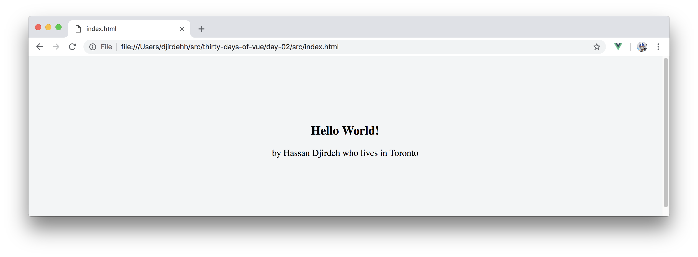

# The Vue Instance - Data

In the first article, we had a brief look at what Vue is and how we’re able to instantiate a Vue application with the Vue instance. In this article, we’ll be taking a deeper look at the Vue instance and how it drives the ability to create data-driven applications.

## The Vue Instance

To reiterate what we’ve learned, the Vue instance is the starting point of Vue applications and contains a data property that allows us to bind data from our instance and on to the template. In the last article, we bound the value of a `greeting` data property on to the text content of an `<h2>` tag. Let’s revisit that example and introduce a few more data properties:

```javascript
new Vue({
  el: '#app',
  data: {
    greeting: 'Hello World!',
    user: 'Hassan Djirdeh',
    city: 'Toronto'
  }
});
```

We've introduced `user` and `city` data properties that have values of `'Hassan Djirdeh'` and `'Toronto'` respectively. We can re-use the Mustache Syntax to bind these new data properties onto the template:

```html
<html>
  <head>
    <link rel="stylesheet" href="./styles.css" />
  </head>

  <body>
    <div id="app">
      <h2>{{ greeting }}</h2>
      <p>by {{ user }} who lives in {{ city }}</p>
    </div>
    <script src="https://unpkg.com/vue"></script>
    <script src="./main.js"></script>
  </body>
</html>
```

In the code above, we're also introducing a local stylesheet, `styles.css`, to apply some simple styling on to our application.

With the data being bound to the template, we're now able to see the values of these different data properties.



In Vue, information within the `data` property of an instance is known to be [reactive](https://vuejs.org/v2/guide/reactivity.html). This means that if we manage to modify or change the data values of a Vue instance, Vue will _recognize_ this change and re-render the template to show the _updated_ data values.

## Methods and Handling Events

Let’s see an example of data reactivity. To help facilitate a change in data, we’ll provide the user with a button that will be responsible for changing the greeting message itself (i.e. the value of the `greeting` data property). We’ll place this button at the bottom of our template:

```html
<html>
  <head>
    <link rel="stylesheet" href="./styles.css" />
  </head>

  <body>
    <div id="app">
      <h2>{{ greeting }}</h2>
      <p>by {{ user }} who lives in {{ city }}</p>
      <button>Change Greeting</button>
    </div>
    <script src="https://unpkg.com/vue"></script>
    <script src="./main.js"></script>
  </body>
</html>
```

As of right now, our button doesn’t do anything. We can attach a click listener to the button to trigger some functionality change that would do the work to change the instance greeting property. This would be a good moment to use the instance's [methods](https://vuejs.org/v2/guide/events.html#Method-Event-Handlers) property:

```javascript
new Vue({
  el: '#app',
  data: {
    greeting: 'Hello World!',
    user: 'Hassan Djirdeh',
    city: 'Toronto'
  },
  methods: {
    // instance methods
  }
});
```

The **methods** property of a Vue instance allows us to define methods bound to that instance that behave like normal JavaScript functions (i.e. are evaluated only when called). In these methods, we’re able to directly change data values kept in our instance.

I> Instead of using **methods**, we could also write our intended functionality change _inline_ in the template. We'll be discussing more of this in article **#8 - Methods & Computed Properties**.

In our example, we’ll create a `changeGreeting()` method that toggles the value of the `greeting` data property:

```javascript
new Vue({
  el: '#app',
  data: {
    greeting: 'Hello World!',
    user: 'Hassan Djirdeh',
    city: 'Toronto'
  },
  methods: {
    changeGreeting() {
      this.greeting = this.greeting === 'Hello World!' ?
       'What is up!' :
       'Hello World!';
    }
  }
});
```

We’re using a simple [ternary operator](https://developer.mozilla.org/en-US/docs/Web/JavaScript/Reference/Operators/Conditional_Operator) to toggle the value of the `greeting` property from `'Hello World!'` to `'What is up!'` and vice versa.

Notice how we’re referencing the value of the `greeting` property with `this.greeting`? When a Vue instance is instantiated, Vue recursively creates a series of getters and setters for each data property to make them _reactive_. Within an instance, the data object can then be accessed with `this.$data`. With [proxying](https://developer.mozilla.org/en-US/docs/Web/JavaScript/Reference/Global_Objects/Proxy), Vue proxies all the properties of the instance so `this.$data.greeting` is equal to simply stating `this.greeting`. We’ll be talking a little more about reactivity and data-driven Vue apps tomorrow, but for more reading on this - be sure to check out the [Options/Data section](https://vuejs.org/v2/api/#data) of the Vue documentation.

With our method prepared, we’ll need to call the method from our template when the user clicks the 'Change Greeting' button. To handle this interaction, we’ll use Vue’s [v-on directive](https://vuejs.org/v2/guide/events.html).

I> A Vue directive is essentially a special type of command that can be added to HTML content. We'll be discussing, in more detail, Vue's most commonly used native directives in articles **#4**, **#5**, and **#6**.

The **v-on** directive is one of the many native Vue directives available to us in the template. To be able to listen to the button click event and run the instance `changeGreeting()` method, we’ll attach the **v-on** directive to a click listener on the button element.

```html
<html>
  <head>
    <link rel="stylesheet" href="./styles.css" />
  </head>

  <body>
    <div id="app">
      <h2>{{ greeting }}</h2>
      <p>by {{ user }} who lives in {{ city }}</p>
      <button v-on:click="changeGreeting">Change Greeting</button>
    </div>
    <script src="https://unpkg.com/vue"></script>
    <script src="./main.js"></script>
  </body>
</html>
```

When we now click the button, the `changeGreeting()` method is called which changes the value of the `greeting` data property. When the `greeting` data property changes, the template is automatically re-rendered to show the change.

Give it a try! Click the 'Change Greeting' button multiple times to witness the greeting text change back and forth.

**TODO - Show app - not image**


We’ll stop here for now and spend a little time tomorrow discussing how the things we’ve learned today shape the way we build data-driven applications in Vue.
