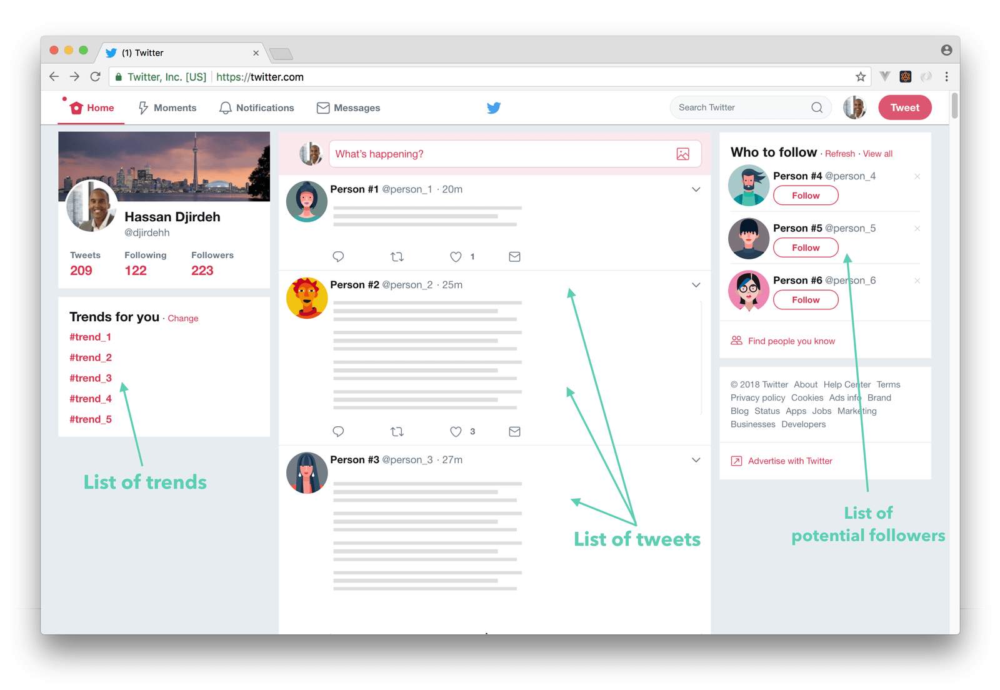
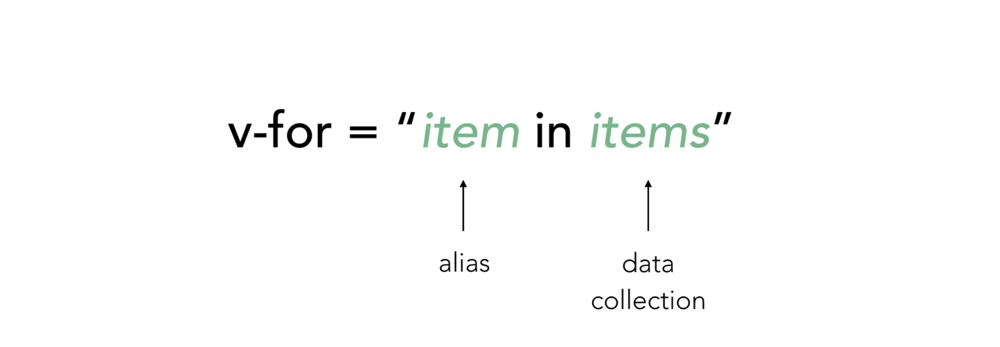

# List Rendering with v-for

> Today we're going to work through how the **v-for** directive can be used to render a list of elements based on a data source.

Today's article is a summarized and simpler version of the article **List Rendering and Vue's v-for directive**, which was originally posted on [CSS-Tricks](https://css-tricks.com/list-rendering-and-vues-v-for-directive/) and the [freeCodeCamp](https://medium.freecodecamp.org/an-introduction-to-dynamic-list-rendering-in-vue-js-a70eea3e321) blogs.

## List Rendering

List rendering is one of the most commonly used practices in front-end web development. Dynamic list rendering allows us to present a series of similarly grouped information in a concise and friendly format to the user. In almost every web application we use, we can see _lists_ of content in numerous areas of the app.

Take a website like [Twitter](https://twitter.com) for example. When logged in and in the main index route, we’re presented with a view similar to this:



On the homepage, we’ve become accustomed to seeing a list of trends, a list of tweets, a list of potential followers, etc. The content displayed in these lists depends on a multitude of factors—our Twitter history, who we follow, our likes, etc. As a result, it's probably safe to say all this data is dynamic.

Though this data is dynamically obtained, the way this data is shown remains the same. This is in part due to **rendering lists of reusable elements**.

If we wanted to render a list of elements in Vue, the first thing that should come to mind to accomplish this is the [**v-for**](https://vuejs.org/v2/guide/list.html) directive.

## The v-for directive

The **v-for** directive is used to render a list of items based on a data source. The directive can be used on a template element and requires a specific syntax along the lines of `item` in `items`, where `items` is a data collection and `item` is an alias for every element that is being iterated upon:



Let’s see a very simple example of this in practice. Assume we have a template currently displaying a list of static numbers in ascending order:

```html
<html>
  <head>
    <link rel="stylesheet" href="./styles.css" />
  </head>

  <body>
    <div id="app">
      <ul>
        <li>1</li>
        <li>10</li>
        <li>100</li>
        <li>1000</li>
        <li>10000</li>
      </ul>
    </div>
    <script src="https://unpkg.com/vue"></script>
    <script src="./main.js"></script>
  </body>
</html>
```

<iframe src='./src/static-list-example/index.html'
        height="275"
        scrolling="no"
         >
</iframe>

If we had the list of numbers available to us in a collection (e.g. an array) in our Vue instance:

```javascript
new Vue({
  el: '#app',
  data: {
    numbers: [1, 10, 100, 1000, 10000],
  },
});
```

We could avoid repeating the `<li>` element in the template and instead have the **v-for** directive do the work for us. Since `numbers` is the array we’ll be iterating over, `number` would be an appropriate alias to use. We’ll add the **v-for** directive on the element we want repeated - the `<li>` element:

```html
<html>
  <head>
    <link rel="stylesheet" href="./styles.css" />
  </head>

  <body>
    <div id="app">
      <ul>
        <li v-for="number in numbers">{{ number }}</li>
      </ul>
    </div>
    <script src="https://unpkg.com/vue"></script>
    <script src="./main.js"></script>
  </body>
</html>
```

We’re using the Mustache syntax to bind the `number` alias on to the text content of the repeated element since we’re interested in only displaying the number values from the array.

At this moment, the **v-for** directive would display the list of static numbers from the `numbers` data array:

<iframe src='./src/v-for-example/index.html'
        height="275"
        scrolling="no"
         >
</iframe>

In addition to helping make the template be more [D.R.Y](https://en.wikipedia.org/wiki/Don%27t_repeat_yourself), the **v-for** directive is helpful since our application is now entirely dynamic. Regardless of how the `numbers` array changes over time, our set up will always render all the numbers in the collection in the same markup we expect.

## The key attribute

It’s common practice to specify a [**key**](https://vuejs.org/v2/guide/list.html#key) attribute for every iterated element within a rendered **v-for** list. This is because Vue uses the **key** attribute to create **unique bindings for each node’s identity**.

If there were any dynamic UI changes to our list (e.g. numbers list gets randomly reshuffled), Vue will (by default) opt towards changing data within each element _instead_ of moving the DOM elements accordingly. This won’t be an issue in most cases. However, in certain instances where our **v-for** list depends on DOM state and/or child component state, this can cause some unintended behavior.

Let’s see an example of this. Instead of rendering just the `number` content within each element, let’s render both the `number` value and an `input` element for each number in the `numbers` array.

```html
<html>
  <head>
    <link rel="stylesheet" href="./styles.css" />
  </head>

  <body>
    <div id="app">
      <ul>
        <li v-for="number in numbers">
          <p>{{ number }}</p>
          <input placeholder="type something..."/>
        </li>
      </ul>
    </div>
    <script src="https://unpkg.com/vue"></script>
    <script src="./main.js"></script>
  </body>
</html>
```

Assume we wanted to introduce another new feature into our app. This feature would involve allowing the user to shuffle the list of numbers randomly. To do this, we’ll first include a “Shuffle!” button in our HTML template right after the unordered list:

```html
<html>
  <head>
    <link rel="stylesheet" href="./styles.css" />
  </head>

  <body>
    <div id="app">
      <ul>
        <li v-for="number in numbers">
          <p>{{ number }}</p>
          <input placeholder="type something..."/>
        </li>
      </ul>
      <button @click="shuffle">Shuffle!</button>
    </div>
    <script src="https://unpkg.com/vue"></script>
    <script src="https://cdn.jsdelivr.net/npm/lodash@4.17.11/lodash.min.js"></script>
    <script src="./main.js"></script>
  </body>
</html>
```

We’ve attached a click event listener on the button element to call a `shuffle` method when triggered. We've also introduced a new `<script>` tag in our template that has a `src` pointing to a CDN of the [Lodash](https://lodash.com/) utility library. We'll be using Lodash to help create the shuffle functionality in our list.

In our Vue instance; we’ll create the `shuffle` method responsible for randomly shuffling the `numbers` collection in the instance. To avoid having to create a random shuffle of our own, we’ll use the Lodash [\_.shuffle](https://lodash.com/docs/4.17.11#shuffle) method to achieve this:

```javascript
new Vue({
  el: '#app',
  data: {
    numbers: [1, 10, 100, 1000, 10000],
  },
  methods: {
    shuffle() {
      this.numbers = _.shuffle(this.numbers)
    }
  }
});
```

I> [Lodash](https://lodash.com/) is a JavaScript utility library that provides a large collection of additional methods to help interact with arrays, objects, numbers, strings, etc. In our application, we're simply using the [\_.shuffle](https://lodash.com/docs/4.17.11#shuffle) method which shuffles an array using a version of the [Fisher-Yates algorithm](https://exceptionnotfound.net/understanding-the-fisher-yates-card-shuffling-algorithm/).

If we save our changes, refresh the app, and click the shuffle button a few times; we’ll notice the numbers in the list get randomly assorted with each click.

<iframe src='./src/v-for-no-key-example/index.html'
        height="515"
        scrolling="no"
         >
</iframe>

However, if we type some information in the input of each list element _then_ click shuffle; we’ll notice something peculiar happening:


Though each rendered list element contains its own displayed `number` and `input` field, when we shuffle the list - the `number` in the element **is the only portion that gets shuffled**. This is because since we haven’t opted to using the **key** attribute, Vue has not created unique bindings to each list item. As a result, when we’re aiming to reorder the list items, Vue takes the more performant saving approach to _simply change (or patch)_ data in each element. Since the temporary DOM state (i.e. the inputted text) remains in place, we experience this potentially unintended mismatch.


To avoid this; we’ll have to assign a **key** to every rendered element in the list. The **key** attribute for every element should be _unique_ so we’ll restructure our **numbers** collection to be a series of objects with each object containing _id_ and _value_ properties:

```javascript
new Vue({
  el: '#app',
  data: {
    numbers: [
      {id: 1, value: 1},
      {id: 2, value: 10},
      {id: 3, value: 100},
      {id: 4, value: 1000},
      {id: 5, value: 10000}
    ],
  },
  methods: {
    shuffle() {
      this.numbers = _.shuffle(this.numbers)
    }
  }
});
```

In the template, we’ll now reference `number.value` as the text content that would be rendered and we’ll use the **v-bind** directive to bind `number.id` as the **key** attribute for the **v-for** directive:

```html
<html>
  <head>
    <link rel="stylesheet" href="./styles.css" />
  </head>

  <body>
    <div id="app">
      <ul>
        <li v-for="number in numbers" :key="number.id">
          <p>{{ number.value }}</p>
          <input placeholder="type something..." />
        </li>
      </ul>
      <button @click="shuffle">Shuffle!</button>
    </div>
    <script src="https://unpkg.com/vue"></script>
    <script src="https://cdn.jsdelivr.net/npm/lodash@4.17.11/lodash.min.js"></script>
    <script src="./main.js"></script>
  </body>
</html>
```

Vue will now recognize each list element’s identity; and thus _reorder_ the elements when we intend on shuffling the list. Give it a try here - type some information in a few input fields and click shuffle a few times.

<iframe src='./src/v-for-with-key-example/index.html'
        height="515"
        scrolling="no"
         >
</iframe>

Should the **key** attribute always be used? **It’s recommended**. The [Vue docs](https://vuejs.org/v2/guide/list.html#key) specify that the **key** attribute should only be omitted if:

-   We intentionally want the default manner of patching elements in place for performance reasons.
-   Or the DOM content is simple enough.

Great work today! Tomorrow we’ll be taking a look at Vue's **v-model** directive.
