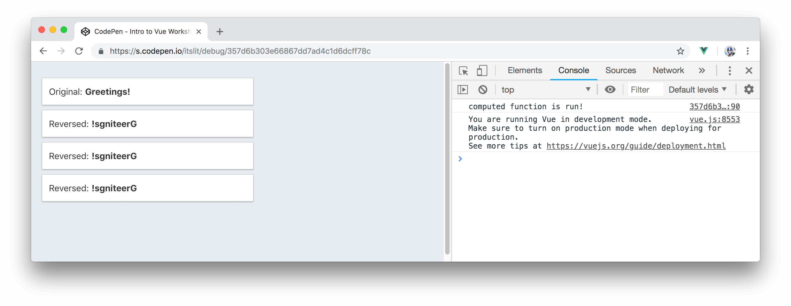
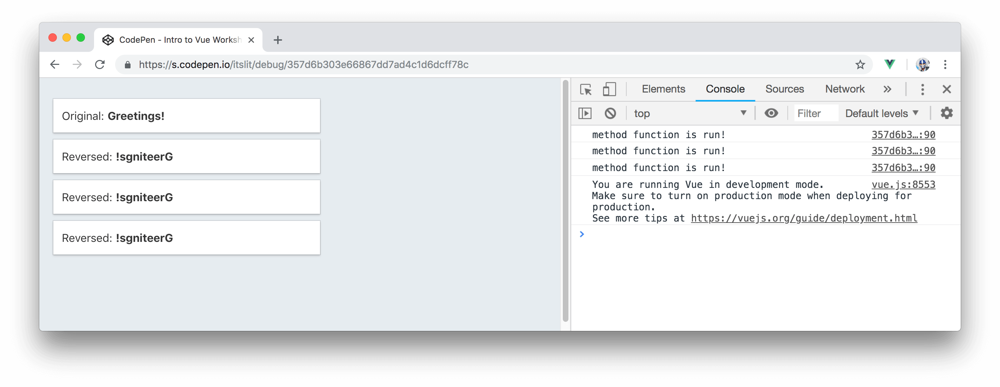
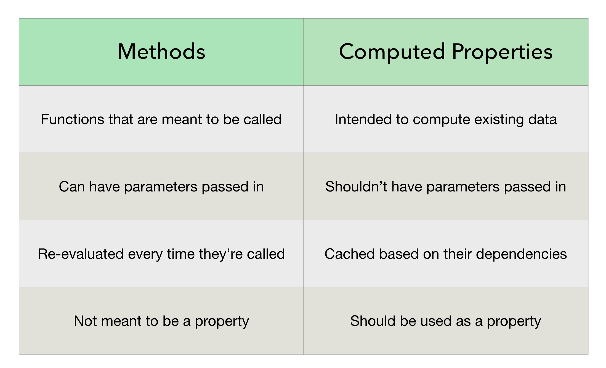

# Methods and Computed Properties

> Today, we'll take a look at the **computed property** of a Vue instance and see how it differs from using a standard instance **method**.

Phew! We made it to week two (relatively unscathed)! Through this point, we've talked through some of the basic features of the Vue instance (data reactivity), template binding (Mustache syntax/directives), and the Vue Devtools.

In this article, we're going to look at two specific properties of the Vue instance - **Methods** and **Computed Properties**.

## Methods

We used methods in articles **#2** and **#3** to highlight reactivity of data contained within a Vue instance. To reiterate, methods in a Vue instance behave like normal JavaScript functions and are evaluated only when explicitly called. Instead of using methods we could always write our intended functionality change _inline_ in the template.

Let’s see an example of this. We’ll reuse an [example](https://vuejs.org/v2/guide/computed.html#Computed-Properties) seen in the Vue documentation that involves reversing a series of characters from a string. We'll first create a Vue instance that contains a single `greeting` property that has a value of `'Greetings!'`:

```javascript
new Vue({
  el: '#app',
  data: {
    message: 'Greetings!',
  },
});
```

In the template, we’ll bind the `message` directly and also bind the `message` in its reversed state. We’ll reverse the value of `message` by splitting the property into an array of characters (`.split('')`), reversing the elements in the array (`.reverse()`), and rejoining the reversed array back into a single string (`.join('')`).

```html
<html>
  <head>
    <link rel="stylesheet" href="./styles.css" />
    <link rel="stylesheet"
      href="https://cdnjs.cloudflare.com/ajax/libs/bulma/0.5.3/css/bulma.css" >
  </head>

  <body>
    <div id="app">
      <div class="card">
        <header class="card-header card-header-title">
          <span>Original:</span> {{ message }}
        </header>
        
        <header class="card-header card-header-title">
          <span>Reversed:</span> {{ message.split('').reverse().join('') }}
        </header>
      </div>
    </div>
    <script src="https://unpkg.com/vue"></script>
    <script src="./main.js"></script>
  </body>
</html>
```

With the help of the styling given to us by [Bulma](https://bulma.io/documentation/), our simple app will look like the following:

<iframe src='./src/inline-example/index.html'
        height="120"
        scrolling="no"
         >
</iframe>

There’s nothing inherently wrong with specifying functionality change, like the above, inline. However, **methods** are often times more appropriate to use when the intended changes get harder to decipher.

We can change the above example to instead use a **method** in our Vue instance to help reverse the `message` string:

```javascript
new Vue({
  el: '#app',
  data: {
    message: 'Greetings!',
  },
  methods: {
    reverseString(string) {
      return string.split('').reverse().join('');
    },
  }
});
```

The method is given a name of `reverseString` and expects a payload. We can declare this method in the template and pass in the `message` property as the payload:

```html
<html>
  <head>
    <link rel="stylesheet" href="./styles.css" />
    <link rel="stylesheet"
      href="https://cdnjs.cloudflare.com/ajax/libs/bulma/0.5.3/css/bulma.css" >
  </head>

  <body>
    <div id="app">
      <div class="card">
        <header class="card-header card-header-title">
          <span>Original:</span> {{ message }}
        </header>
        
        <header class="card-header card-header-title">
          <span>Reversed:</span> {{ reverseString(message) }}
        </header>
      </div>
    </div>
    <script src="https://unpkg.com/vue"></script>
    <script src="./main.js"></script>
  </body>
</html>
```

Our UI would behave just the way it had before by displaying the message greeting and the reversed version right below it:

<iframe src='./src/methods-example/index.html'
        height="120"
        scrolling="no"
         >
</iframe>

Functionality wise - the above two examples achieve the same thing. Methods might be seen to be more appropriate since it keeps the template cleaner and easier to understand.

We’re also able to achieve the same outcome as above with the use of another property - called the [**computed**](https://vuejs.org/v2/guide/computed.html#Computed-Properties) property.

## Computed Properties

**Computed** properties are used to handle complex calculations of information that need to be displayed in the view. For our third iteration in building the same simple app, we'll introduce a **computed** property called `reverseMessage` that simply reverses the `message` data property like we’ve done before:

```javascript
new Vue({
  el: '#app',
  data: {
    message: 'Greetings!',
  },
  computed: {
    reverseMessage() {
      return this.message.split('').reverse().join('');
    },
  }
});
```

In the template, we can render the value of the `reverseMessage` computed property just as we would have rendered any other data property:

```html
<html>
  <head>
    <link rel="stylesheet" href="./styles.css" />
    <link rel="stylesheet"
      href="https://cdnjs.cloudflare.com/ajax/libs/bulma/0.5.3/css/bulma.css" >
  </head>

  <body>
    <div id="app">
      <div class="card">
        <header class="card-header card-header-title">
          <span>Original:</span> {{ message }}
        </header>
        
        <header class="card-header card-header-title">
          <span>Reversed:</span> {{ reverseMessage }}
        </header>
      </div>
    </div>
    <script src="https://unpkg.com/vue"></script>
    <script src="./main.js"></script>
  </body>
</html>
```

With this, our app will behave as desired:

<iframe src='./src/computed-example/index.html'
        height="120"
        scrolling="no"
         >
</iframe>

This begs the question, what difference is there to using a **computed** property or have a **method** instead return a value?

## Methods vs. Computed Properties

In the examples above, using a **method** or a **computed** property pretty much achieved the exact same outcome. The key difference to using **computed** properties is that **computed properties are cached based on the dependencies they depend on**.

If we take a look at the `reverseMessage` computed property we’ve declared, we can see it has one data dependancy - the `message` property.

```javascript
computed: {
  reverseMessage() {
    return this.message.split('').reverse().join('');
  },
}
```

The value of `reverseMessage` directly depends on the `message` data property. When the value of `message` changes, so does `reverseMessage`. **Computed** properties are useful because as long as the dependant data property (`message`) remains constant (i.e. unchanged), calling the **computed** property (`reverseMessage`) multiple times will always return the _same cached value_.

Let's see a simple example of this visually. We can place a `console.log()` message in the **computed** property function to alert us when the function has been run:

```javascript
computed: {
  reverseMessage() {
    console.log('computed function is run!');
    return this.message.split('').reverse().join('');
  },
}
```

In the template, we can aim to render the `reverseMessage` computed property a couple of times:

```html
<div id="app">
  <div class="card">
    <header class="card-header card-header-title">
      <span>Original:</span> {{ message }}
    </header>
  </div>
  
  <div class="card">
    <header class="card-header card-header-title">
      <span>Reversed:</span> {{ reverseMessage }}
    </header>
  </div>
  
  <div class="card">
    <header class="card-header card-header-title">
      <span>Reversed:</span> {{ reverseMessage }}
    </header>
  </div>
  
  <div class="card">
    <header class="card-header card-header-title">
      <span>Reversed:</span> {{ reverseMessage }}
    </header>
  </div>
</div>
```

By running the application and opening our browser console, we’ll see the `console.log()` message logged **only once**:



The first time the `reverseMessage` property is computed, its value is cached. With every other call to render the value of `reverseMessage`, the `message` property hasn’t changed, so the cached result is simply returned without running the **computed** function again.

If we repeat a similar example but instead call **methods** multiple times in the template, the `console.log()` message will be run every single time the method is declared:



In conclusion, though **methods** can be used in place of **computed** properties - **computed** properties should essentially be used if we intend to _compute_ a value from a data property. Caching can help our application with performance once our application starts to have countless properties with each derived functionality potentially being somewhat computationally expensive.

Here's a table that highlights the main differences between using **methods** or **computed** properties:



A good rule of thumb to follow:

-   Use **methods** when responding to changes (e.g. clicking a button, submitting a form, etc.) or to run explicit functionality change within the instance (e.g. have a method be called from a lifecycle hook).
-   Use **computed** properties for data manipulation (e.g. create a sorted array from an unsorted array in the instance).

We’ll be stopping here for today and be taking a look at another instance property called **watchers** tomorrow.
