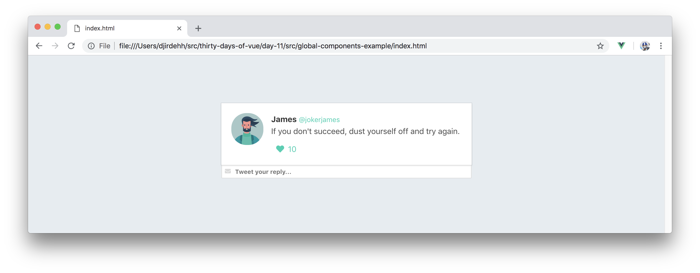
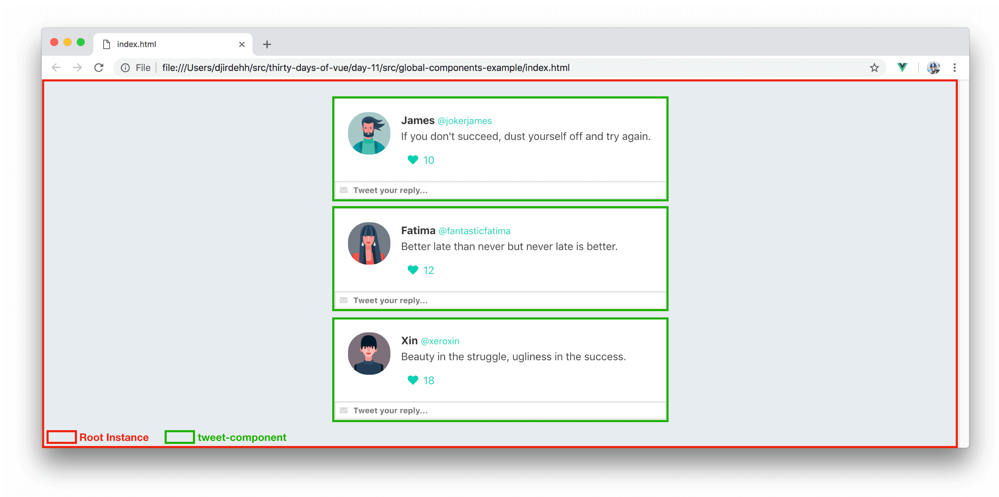

# Vue Components - Global Components

> In today's session, we'll be building our first global Vue component.

In the last week and a half, we’ve covered a large number of properties and features within a Vue instance. We’ve discussed an instance’s reactivity, its directives, methods, computed properties, watchers, and lifecycle hooks. For those who might have used other newer front end libraries/frameworks, you may have noticed we haven’t discussed a vital piece of modern UI development - __components__.

## Components

Vue provides the ability for us to create isolated components within an application. Reusability and maintainability are some of the main reasons as to why building an application with well-structured components are especially important.

Vue components are intended to be self-contained modules since we can group markup (HTML), logic (JS), and even styles (CSS) within them. This allows for easier maintenance, especially when applications grow much larger in scale.

An important note to keep in mind is that __Vue components _are_ Vue instances__. This means almost all the properties we’ve seen thus far (except for a few root-level options) in a root instance are applicable to components as well. In fact, the [Vue documentation](https://vuejs.org/v2/guide/components.html) states that _“[Vue] components are reusable Vue instances with a name…”_.

To get a better understanding of components, we’ll go ahead and create one.

## Simple Twitter App

By the end of tomorrow's article, we’ll look to have created a mock Twitter application that displays a list of tweets from a data source.


The data source will be available to us on the client-side and passed into the data property of the application instance:

```javascript
const tweets = [
  {
    id: 1,
    name: 'James',
    handle: '@jokerjames',
    img: 'https://semantic-ui.com/images/avatar2/large/matthew.png',
    tweet: "If you don't succeed, dust yourself off and try again.",
    likes: 10,
  },
  { 
    id: 2,
    name: 'Fatima',
    handle: '@fantasticfatima',
    img: 'https://semantic-ui.com/images/avatar2/large/molly.png',
    tweet: 'Better late than never but never late is better.',
    likes: 12,
  },
  {
    id: 3,
    name: 'Xin',
    handle: '@xeroxin',
    img: 'https://semantic-ui.com/images/avatar2/large/elyse.png',
    tweet: 'Beauty in the struggle, ugliness in the success.',
    likes: 18,
  }
];

new Vue({
  el: '#app',
  data: {
    tweets
  }
});
```

By binding the information of just the first `tweet` object on to the template, our HTML will look something like the following:

```html
<html>
  <head>
    <link rel="stylesheet" href="./styles.css" />
    <link rel="stylesheet"
      href="https://cdnjs.cloudflare.com/ajax/libs/bulma/0.5.3/css/bulma.css" >
    <link rel="stylesheet"
      href="https://use.fontawesome.com/releases/v5.6.1/css/all.css">
  </head>

  <body>  
    <div id="app">    
      <div class="tweet">
        <div class="box">
          <article class="media">
            <div class="media-left">
              <figure class="image is-64x64">
                
              </figure>
            </div>
            <div class="media-content">
              <div class="content">
                <p>
                  <strong>{{tweets[0].name}}</strong>
                  <small>{{tweets[0].handle}}</small>
                  <br>
                  {{tweets[0].tweet}}
                </p>
              </div>
              <div class="level-left">
                <a class="level-item">
                  <span class="icon is-small">
                    <i class="fas fa-heart"></i>
                  </span>
                  <span class="likes">{{tweets[0].likes}}</span>
                </a>
              </div>
            </div>
          </article>
        </div>
        <div class="control has-icons-left has-icons-right">
          <input class="input is-small" placeholder="Tweet your reply..." />
          <span class="icon is-small is-left">
            <i class="fas fa-envelope"></i>
          </span>
        </div>
      </div>
    </div>
    <script src="https://unpkg.com/vue"></script>
    <script src="./main.js"></script>
  </body>
</html>
```

With the appropriate styles already prepared for us, our application will now look like this:



Our aim is to show a tweet element for every single `tweet` object available in our data. Since we’ll be rendering a list of elements, the best way to achieve this is with the help of the __v-for__ directive:

```html
<html>
  <head>
    <link rel="stylesheet" href="./styles.css" />
    <link rel="stylesheet"
      href="https://cdnjs.cloudflare.com/ajax/libs/bulma/0.5.3/css/bulma.css" >
    <link rel="stylesheet"
      href="https://use.fontawesome.com/releases/v5.6.1/css/all.css">
  </head>

  <body>
    <div id="app">
      <div class="tweet" v-for="tweet in tweets" :key="tweet.id">
        <div class="box">
          <article class="media">
            <div class="media-left">
              <figure class="image is-64x64">
                
              </figure>
            </div>
            <div class="media-content">
              <div class="content">
                <p>
                  <strong>{{tweet.name}}</strong>
                  <small>{{tweet.handle}}</small>
                  <br>
                  {{tweet.tweet}}
                </p>
              </div>
              <div class="level-left">
                <a class="level-item">
                  <span class="icon is-small">
                    <i class="fas fa-heart"></i>
                  </span>
                  <span class="likes">{{tweet.likes}}</span>
                </a>
              </div>
            </div>
          </article>
        </div>
        <div class="control has-icons-left has-icons-right">
          <input class="input is-small" placeholder="Tweet your reply..." />
          <span class="icon is-small is-left">
            <i class="fas fa-envelope"></i>
          </span>
        </div>
      </div>
    </div>
    <script src="https://unpkg.com/vue"></script>
    <script src="./main.js"></script>
  </body>
</html>
```

In the template above, we’re binding the contents of the iterated `tweet` object onto our template. This renders a list of tweet elements with each element containing details of a single `tweet` object:


## Global Components

If we take a look at the UI we've set up, we can distinctively point out the pieces of our application that could be made to be __self contained modules of their own__.



The __Root Instance__ resembles the entire root instance of our application while __tweet-component__ could be the instance that isolates the markup responsible for a single tweet element.

Let's go ahead and create this __tweet-component__. The simplest method for creating a component is using the `Vue.component()` constructor.

```javascript
Vue.component('tweet-component', { 
  // options
});
```

The `Vue.component()` constructor registers a component _globally_ in an application. In the constructor above, the first argument we've passed in is the name (i.e. the identifier) of the component  - __tweet-component__. In the second argument, we've passed in an empty `options` object that will contain the _definition_ of the component such as its data, methods, etc.

Though there are a few different ways to declare the template of a component, the standard way of doing so is using the __template__ option which expects a string value.

I> We haven’t found the need to use the __template__ option in our root instance since we were able to use the root-level option, [__el__](https://vuejs.org/v2/api/#vm-el), to declare the view our instance will depend upon.

To get things started, we’ll create a __tweet-component__ with hard-coded data. We’ll specify the template of the component to simply be the markup associated with `<div class="tweet">...</div>`. We'll create this component right before the instantiation of our root instance.

{lang=javascript,line-numbers=off,crop-start-line=28,crop-end-line=66}
<<[src/global-components-example/main.js](./src/global-components-example/main.js)

We’ve declared the template of the component within backticks (i.e. [ES6 template literals](https://developer.mozilla.org/en-US/docs/Web/JavaScript/Reference/Template_literals)) to be able to neatly arrange the markup in multi-line format.

I> Template literals are an [unsupported feature for older browsers like IE11](https://developer.mozilla.org/en-US/docs/Web/JavaScript/Reference/Template_literals#Browser_compatibility).

With the component created, we’ll now be able to render the component in the root template. We’ll want the component to be rendered for every tweet in the `tweets` array. Since we want to render a _list_ of __tweet-component__'s, we'll declare the __v-for__ directive where the component is being rendered. Removing the old template code and rendering a list of __tweet-component__'s would have our root template be updated to the following:

{lang=html,line-numbers=off}
<<[src/global-components-example/index.html](./src/global-components-example/index.html)

At this moment, our application would look like the following:

<iframe src='./src/global-components-example/index.html'
        height="525"
        scrolling="no"
         >
</iframe>

I> Notice how the root template is a lot easier to read now? This is in part due to using components to encapsulate relevant content within themselves. This is a very simple application, but for larger apps - the importance of well structured and named components can’t be stressed enough.

Though we’re rendering a list of components, the application isn’t where we want it to be since each component is rendering the same static information. What we intend to do is have the template of every __tweet-component__ render the details of a single unique tweet object from the `tweets` array.

The `tweets` data array is part of the root instance and __tweet-component__ is generally unaware of its existence. Since __tweet-component__ is rendered as a child of the root instance, we can use something known as __props__ to _pass the relevant data down to the component_.

This is where we'll be picking up tomorrow. In the next article, we’ll spend a little time discussing what __props__ are before updating our app to use __props__ to have our components contain the data they need.