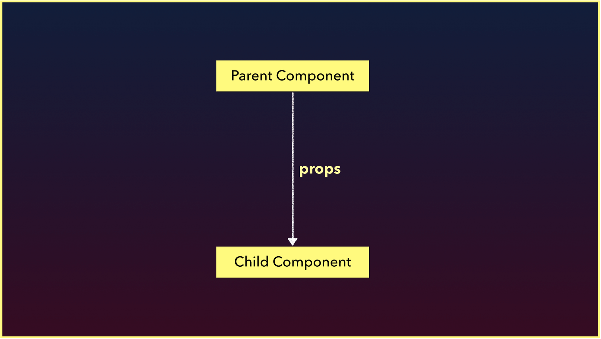
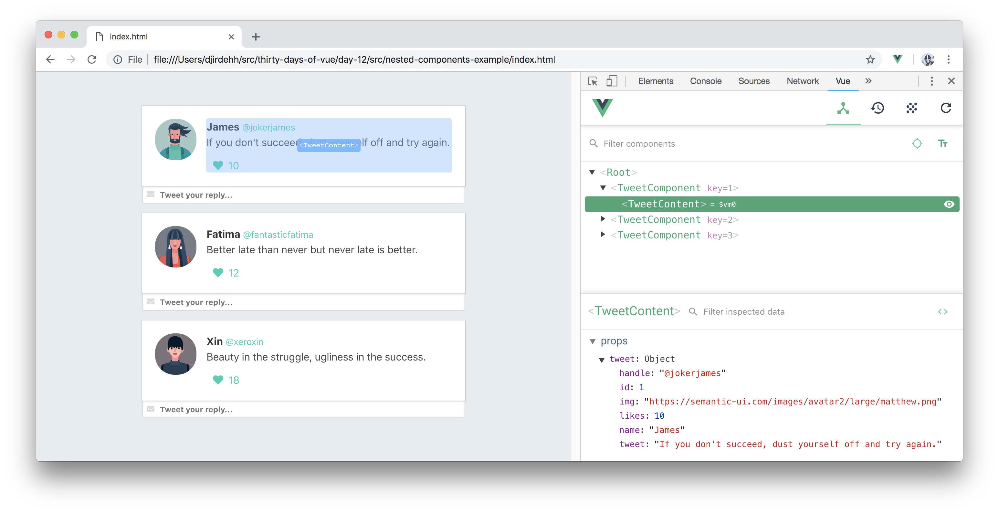

# Vue Components - Props

> Today, we'll discuss how __props__ can help us pass data from parent components down to child components.

In yesterday’s article, we created our first component (named `tweet-component`) as part of a mock twitter application. We went as far as having a list of these `tweet-component`‘s be rendered with only static information.

<iframe src='../day-11/src/global-components-example/index.html'
        height="525"
        scrolling="no"
         >
</iframe>

Our aim today is to have each `tweet-component` render unique tweet data from the `tweets` data array kept in the root instance. We’ll achieve this with the help of [__props__](https://vuejs.org/v2/guide/components-props.html).

## Props
Vue gives us the ability to use __props__ to pass data from parent instances down to child instances.



Using props is fairly simple. The first step involves binding the data that is to be passed to the prop attribute where the child component is being rendered.

In our mock twitter application, we’re interested in passing a single tweet object to every `tweet-component` that is rendered. Since the tweet components are rendered with the help of the __v-for__ directive, we can pass the iterated `tweet` object as props down to each component.

{lang=html,line-numbers=off,crop-start-line=11,crop-end-line=16}
<<[src/props-example/index.html](./src/props-example/index.html)

We’re using the __v-bind__ directive to bind the iterated `tweet` data object to a prop of the same name.

For `tweet-component` to use the prop provided to it, it needs to explicitly declare the props it receives with the `props` option. We’ll introduce a `props` option in `tweet-component` and specify the `tweet` prop being passed in:

```javascript
Vue.component('tweet-component', {
  template: `   
    // ...
  `,
  props: ['tweet']
});
```

In `tweet-component`, the `tweet` prop can now be accessed and used like any other data property. We’ll bind information from the `tweet` prop on to the template of the component instead of statically rendering information.

{lang=javascript,line-numbers=off,crop-start-line=28,crop-end-line=66}
<<[src/props-example/main.js](./src/props-example/main.js)

Our application will now display information from all the different tweets in our instance data.

<iframe src='./src/props-example/index.html'
        height="525"
        scrolling="no"
         >
</iframe>

## Prop Validation

Vue also allows us to define requirements for __props__ that get passed into a component. Earlier, we declared the `tweet` prop in `tweet-component` in this format:

```javascript
Vue.component('tweet-component', {
  template: `   
    // ...
  `,
  props: ['tweet']
});
```

To define prop validation requirements, we can instead provide an object that has validation requirements to the `props` option.

```javascript
Vue.component('tweet-component', {
  template: `   
    // ...
  `,
  props: {
    tweet: {
      type: Object,
      required: true
    }
  }
});
```

If we've stated validation requirements like the above and find ourselves not passing the `tweet` prop or having the `tweet` prop be of a type that is not `Object`, the Vue console will emit warnings. The [Vue documentation](https://vuejs.org/v2/guide/components-props.html#Prop-Validation) has more examples on how we’re able to define default and custom validation requirements as well.

## Parent - Child Relationships

Since every component has its own isolated scope, child components can never (and should never) reference data directly from parent components. For a child component to access data from a parent, data has to flow from the parent down to the child with the help of __props__. This design greatly simplifies the understanding of an applications data flow since child components will never be able to mutate parent state directly.

Props can also be passed down multiple levels deep. For our mock twitter application, assume we wanted `tweet-component` to be a parent of another component labelled `tweet-content`.


We can use the `Vue.component()` constructor to create the `tweet-content` component as we’ve done before. We’ll also declare a `tweet` prop in the `props` property of `tweet-content` and bind the prop’s information to its template. We'll create this `tweet-content` component right above the creation of `tweet-component`.

{lang=javascript,line-numbers=off,crop-start-line=28,crop-end-line=50}
<<[src/nested-components-example/main.js](./src/nested-components-example/main.js)

`tweet-component` will now be able to render the `tweet-content` component and pass in the `tweet` data object as __props__:

{lang=javascript,line-numbers=off,crop-start-line=52,crop-end-line=74}
<<[src/nested-components-example/main.js](./src/nested-components-example/main.js)

Our application UI will remain the same but now be composed of two nested components.

<iframe src='./src/nested-components-example/index.html'
        height="525"
        scrolling="no"
         >
</iframe>

The Vue Devtools is incredibly useful in helping debug our application and inspect what data is being passed from one component to another. By launching the Vue Devtools, we’ll be able to see all the components in our application and the props available within each component.



It’s important to remember that props can only travel in a unidirectional format (parent to child to grandchild, etc.). If we wanted to communicate to a parent component (e.g. the root instance) about changes made in a child component (e.g. `tweet-component`), Vue provides something known as __Custom Events__ to help facilitate this.

Good work so far! We’ll stop here for today and begin tomorrow by discussing Custom Events and how to use them!
