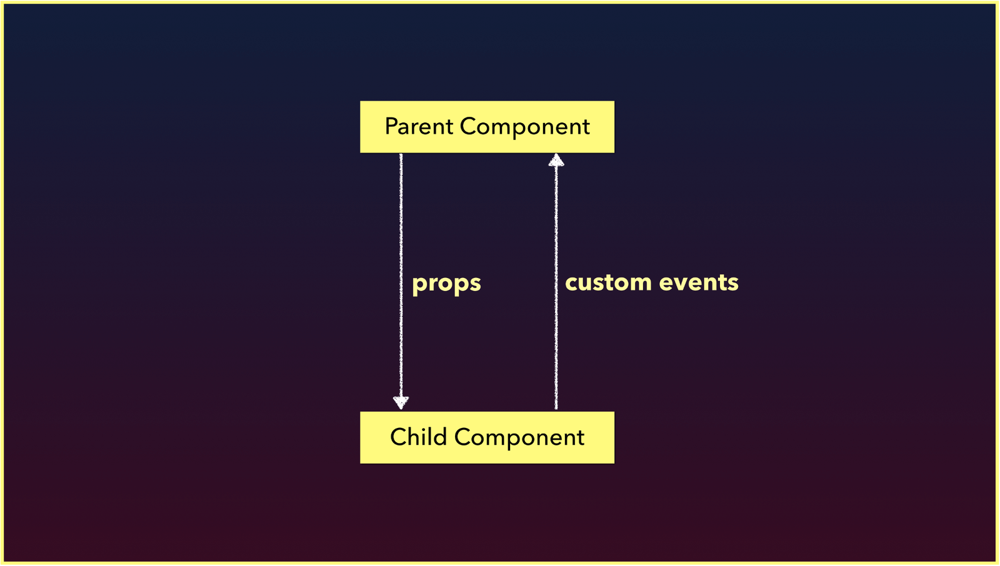
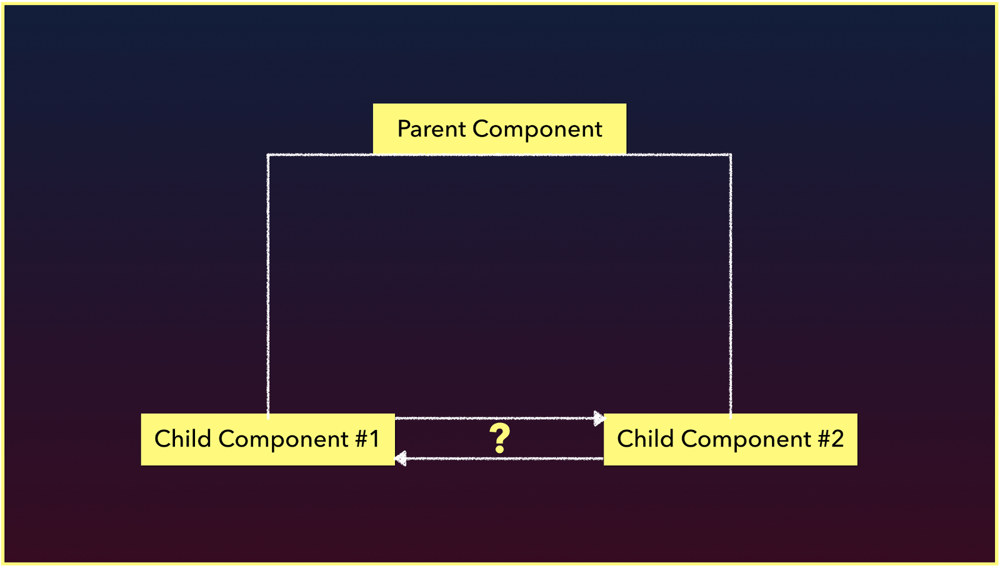
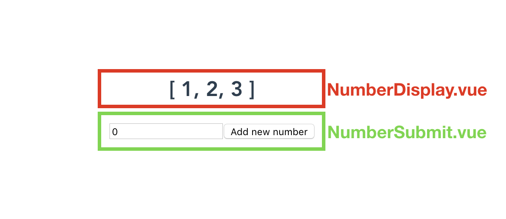
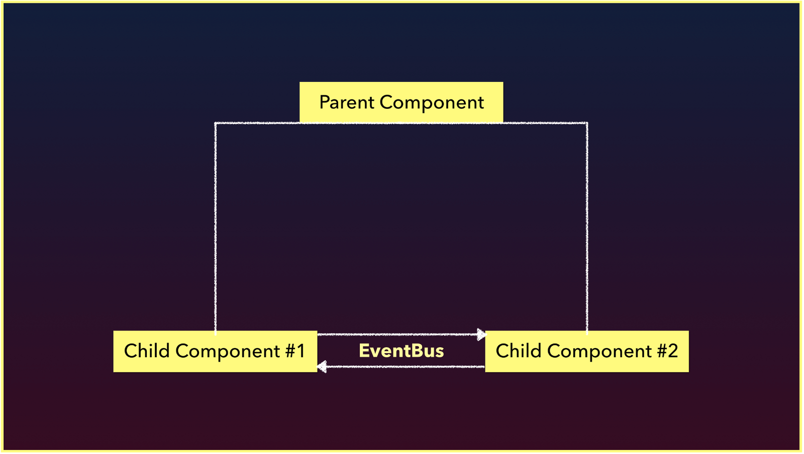
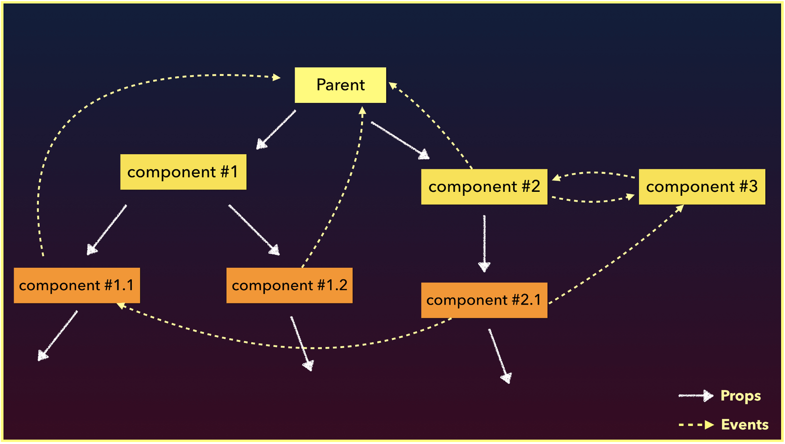

# Custom Events and the EventBus

> Today's session will be the first of a series of articles discussing different methods to managing application wide data. We'll begin by reintroducing **props** and **custom events** before taking a look at how a global **EventBus** can facilitate application wide communication.

Handling data inside a client-side application often begins as a simple process but can end up becoming a seemingly complex task. Today, we’ll begin a three-part series on the different ways we can think about managing application wide data. This three-part series was originally published as the single article - [Managing State in Vue.js](https://medium.com/fullstackio/managing-state-in-vue-js-23a0352b1c87).

We'll begin today's article by reintroducing how **props** and **custom events** allow us to communicate information between parent and child components.

## Props

From what we’ve seen so far, we know that Vue components are the building blocks of Vue applications since they allow us to couple markup (HTML), logic (JS), and styles (CSS) within them.

Here’s an example of a single-file component that displays a series of numbers from a data property.

```html
<template>
  <div>
    <h2>The numbers are {{ numbers }}!</h2>
  </div>
</template>

<script>
export default {
  name: 'NumberComponent',
  data () {
    return {
      numbers: [1, 2, 3]
    }
  },
}
</script>
```

`numbers` is the array stored within the `data()` function of `NumberComponent`. What if `numbers` needed to be accessed from _another_ component? For example, we may need a component to be responsible in displaying `numbers` (like above) and another to manipulate the value of `numbers`. 

To see how `numbers` can be accessed between two components, we'll replicate what `NumberComponent` is doing with a `ParentComponent` and a `ChildComponent`. We’ll have `ParentComponent` pass the `numbers` array to `ChildComponent` where `ChildComponent` will render the `numbers` value. As we’ve seen from before, Vue gives us the ability to use **props** to pass data from the parent down to the child.

### ParentComponent.vue

```html
<template>
  <div>
    <ChildComponent :numbers="numbers" />
  </div>
</template>

<script>
import ChildComponent from "./ChildComponent";

export default {
  name: "ParentComponent",
  data() {
    return {
      numbers: [1, 2, 3]
    };
  },
  components: {
    ChildComponent
  }
};
</script>
```

### ChildComponent.vue

```html
<template>
  <div>
    <h2>{{ numbers }}</h2>
  </div>
</template>

<script>
export default {
  name: "ChildComponent",
  props: {
    numbers: Array
  }
};
</script>
```

The `ParentComponent` passes the `numbers` array as props of the same name down to `ChildComponent`. `ChildComponent` simply binds the value of `numbers` on to its template with the help of the Mustache syntax.

In the application UI, we'll simply be presented with the value of the `numbers` array.

<iframe src='https://thirty-days-of-vue-props.surge.sh/'
        height="150"
        scrolling="no"
         >
</iframe>

Awesome! Regardless of how large our application gets, using props to pass data downwards often remains somewhat the same.


## Custom Events

What if we needed to find a way to communicate information in the opposite direction? An example of this could be allowing the user to introduce a new number to the array presented in the example above _from the child component_. We can’t use props since props can only be used to pass data in a uni-directional format (from parent down to child down to grandchild…). To facilitate having the child component notify the parent about something, we can use Vue **custom events**.



We'll use custom events to have `ChildComponent` be able to facilitate a change to the `ParentComponent`'s `numbers` data property.

### ChildComponent.vue

```html
<template>
  <div>
    <h2>{{ numbers }}</h2>
    <input v-model="number" type="number" />
    <button @click="$emit('number-added', Number(number))">
     Add new number
    </button>
  </div>
</template>

<script>
export default {
  name: "ChildComponent",
  props: {
    numbers: Array
  },
  data() {
    return {
      number: 0
    };
  }
};
</script>
```

### ParentComponent.vue

```html
<template>
  <div>
    <ChildComponent
      :numbers="numbers"
      @number-added="numbers.push($event)"
    />
  </div>
</template>

<script>
import ChildComponent from "./ChildComponent";

export default {
  name: "ParentComponent",
  data() {
    return {
      numbers: [1, 2, 3]
    };
  },
  components: {
    ChildComponent
  }
};
</script>
```

The `ChildComponent` has an input that captures a `number` value and a button, that upon click, emits a `number-added` custom event with the captured `number` value. On the `ParentComponent`, a custom event listener denoted by `@number-added`, is specified **where the child component is being rendered**. When this event is emitted in the child, it pushes the `number` value from the event to `ParentComponent`'s `numbers` array.

If we type a number in the input and click the 'Add new number' button, the number will be added to the `numbers` array that’s being displayed.

<iframe src='https://thirty-days-of-vue-custom-events.surge.sh/'
        height="215"
        scrolling="no"
         >
</iframe>

## Sibling-Sibling Component Communication

We can use **props** to pass data downwards and **custom events** to send messages upwards. How would we be able to either pass data or facilitate communication between two different sibling components?



We can’t use custom events the way we have above because those events are emitted within the interface of a particular component, and as a result the **custom event listener needs to be declared on where the component is being rendered**. In two isolated components, **one component isn’t being rendered within the other**.

There are roughly 3 main ways we can begin to manage information between sibling components and as a result start to handle application wide state management:

1.  Use a global EventBus
2.  Use a simple global store
3.  Use the flux-like library Vuex

In today’s article, we’ll only take a look at how a global EventBus works.

## EventBus

An EventBus is a **Vue instance** that is used to enable **isolated components** to subscribe and publish custom events between one another.

Wait… didn’t we just say isolated components can’t trigger and listen to custom events between one another? They normally can’t, but an EventBus helps us achieve this by being made _global_ for this purpose.

Here’s an example of creating an EventBus instance within an `event-bus.js` file:

```javascript
import Vue from "vue";
export const EventBus = new Vue();
```

We can now use the **interface of the EventBus to emit events**.

Instead of the parent-child component layout we had earlier, assume we wanted to achieve the same interaction between two sibling components - `NumberDisplay` and `NumberSubmit`.



We'll have the `NumberSubmit` component send a custom event when a button is clicked. This custom event, `number-added`, will pass the value of what the user types in the input.

```html
<template>
  <div>
    <input v-model="number" type="number" />
    <button @click="addNumber">
     Add new number
    </button>
  </div>
</template>

<script>
import { EventBus } from "../event-bus.js";

export default {
  name: "NumberSubmit",
  data() {
    return {
      number: 0
    };
  },
  methods: {
    addNumber() {
      EventBus.$emit("number-added", Number(this.number));
    }
  }
};
</script>
```

Now we can have the completely isolated component, `NumberDisplay`, be responsible in displaying a list of number values. `NumberDisplay` will also be listening for a new number that is being entered in `NumberSubmit`.

```html
<template>
  <div>
    <h2>{{ numbers }}</h2>
  </div>
</template>

<script>
import { EventBus } from "../event-bus.js";

export default {
  name: "NumberDisplay",
  data() {
    return {
      numbers: [1, 2, 3]
    };
  },
  created() {
    EventBus.$on("number-added", number => {
      this.numbers.push(number);
    });
  }
};
</script>
```

Since `NumberDisplay` is isolated from `NumberSubmit`, we’re declaring the custom event listener programmatically with `$on`:

```javascript
EventBus.$on('number-added', () => { callback function... })
```

We’re attaching the EventBus listener, `EventBus.$on`, on the `created()` lifecycle hook of the `NumberDisplay` component. Throughout the life of the `NumberDisplay` component, whenever this event gets triggered - the listener callback function will run which pushes the `number` event payload to the component `numbers` array.

With the EventBus, we're be able to now facilitate some form of communication between the two sibling components - `NumberDisplay` and `NumberSubmit`.

<iframe src='https://thirty-days-of-vue-eventbus.surge.sh/'
        height="215"
        scrolling="no"
         >
</iframe>

This answers the question we had in mind - An EventBus can be used to facilitate communication between sibling components.



Notice how easy it was to set up and use an EventBus? Unfortunately, **an EventBus also brings along a clear disadvantage**. Imagine our hypothetical application looked more like this:



Assume all the white lines are **props** that are being passed from the parent down to all the children, and the yellow dashed lines are **events** being emitted and listened from and to a component. Each of these events aren’t being tracked and can be fired from anywhere in our application. This makes things hard to maintain really quickly which can make code frustrating to work with and can become a source of bugs.

This is the primary reason as to why the Vue style-guide states that [**an EventBus is not the recommended approach to application wide data management**](https://vuejs.org/v2/style-guide/#Non-flux-state-management-use-with-caution). As a result, we highly suggest to only use an EventBus for very simple use-cases and experiments.

I> Instead of using an external Vue instance (an EventBus), application wide custom events can also be propagated with the help of the application root instance itself - [this.$root](https://vuejs.org/v2/guide/components-edge-cases.html#Accessing-the-Root-Instance). Using either the app root instance or an EventBus to facilitate communication is not a recommended approach to handling application data.

We’ll be looking at how a simple global store can be a much more useful method to handling application data tomorrow. See you then!
