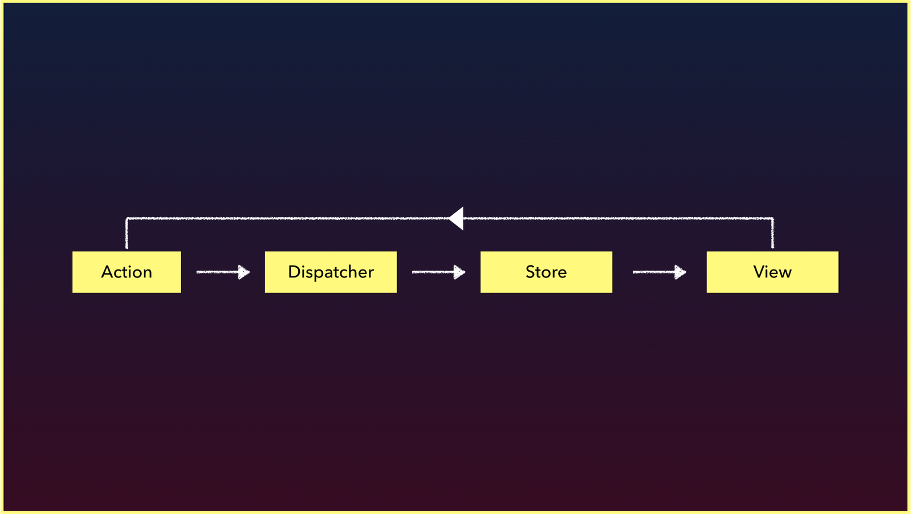

# Introduction to Flux

Handling data inside large client-side applications is a complex task. Today we're looking at a one method of handling complex data proposed by Facebook called the __Flux Architecture__.

As our applications get bigger and more complex, we'll need a better data handling approach. With more data, we'll have more to keep track of.

Our code is required to handle more data and application state with new features. From asynchronous server responses to locally-generated, unsynchronized data, we have to not only keep track of this data, but also tie it to the view in a sane way.

Recognizing this need for data management, the Facebook team released a pattern for dealing with data called [Flux](https://facebook.github.io/flux/docs/overview.html).

Today, we're going to take a look at the Flux architecture, what it is and why it exists.

## The Flux Pattern

[Flux](https://facebook.github.io/flux/docs/overview.html) is a design pattern created by Facebook that manages how data flows through a client-side application. As we've seen, the appropriate method of working with components is through passing data from one parent component to its children components. The Flux pattern makes this model the _default method_ for handling data.

The Flux pattern is usually composed of 4 parts organized as a one-way data pipeline.

The major idea behind Flux is that there is a single-source of truth (the store) that can only be updated by triggering _actions_. The actions are responsible for calling the dispatcher, which the store can _subscribe_ for changes and update its own data accordingly.

I> The key idea behind Flux is __data flows in one direction and kept entirely in the store__.

## Flux Implementations

Flux is a design pattern, not a specific library or implementation. Facebook has [open-sourced a library they use](https://github.com/facebook/flux) that provides the interface for a dispatcher and a store that we can use in our application.

Facebook’s implementation is not the exclusive option. Since Facebook started sharing Flux with the community, the community has responded by [writing tons of different Flux implementations](https://github.com/voronianski/flux-comparison). [Redux](https://github.com/reactjs/redux) has been made incredibly popular within the React ecosystem (and can actually be used in a Vue application with minor configuration changes).

Within the Vue community, however, [Vuex](https://github.com/vuejs/vuex) is the most-widely used, flux-like, state management library.

>  __Plug for fullstackvue__
>
> We discuss this material in-depth with regards Flux, using Vuex, and even integrating Vuex to a large server-persisted shopping-cart app. Check it out at [fullstack.io/vue](https://www.fullstack.io/vue/).

## Vuex

Though Vuex was inspired largely by Flux, it is not itself a _pure_ flux implementation. It also takes inspiration from the [Elm Architecture](https://guide.elm-lang.org/architecture/). Vuex provides the same general principles around how to update the data in our application, but in slightly different (and easier) way.

The main principles of Vuex are:

- The __view__ (i.e components) dispatches actions that describe what happened.
- The __store__ receives these actions and determines what __state changes__ should occur.
- After the state __updates__, the new __state__ is pushed to the view.

This simplicity is what makes Vuex a fairly easy library to understand since it doesn’t include any of the more complicated functionality often found in other flux-like libraries (e.g. middlewares, dispatcher payloads, etc).

In any case, this is enough of an introduction to the flux pattern. Tomorrow we'll actually start working with Vuex to adapt the example applications we've built in the last couple of articles.
