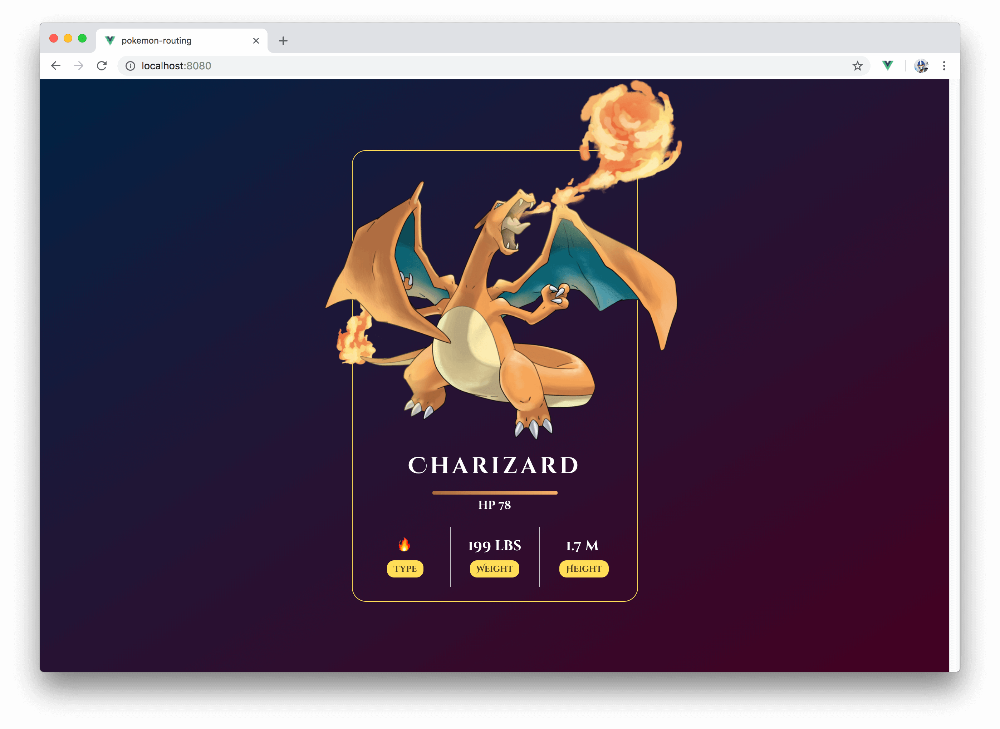

# Introduction to Routing

Most, if not all the large-scale applications we tend to create will usually have multiple views (i.e. pages in different URL routes). For instance, an application might have a login view where a user can log in or a search results page that shows a user a list of their search results. These are two _different_ views with two _different_ page structures.

In today's and tomorrow's article, we'll discuss and build an application that has multiple views with the help of the [Vue Router](https://github.com/vuejs/vue-router) library. The app we'll build will be an adaptation of an application first built as part of the [Let’s Build a Custom Vue Router](https://css-tricks.com/build-a-custom-vue-router/) article originally posted on [CSS-Tricks](https://css-tricks.com/).

## Routing

First and foremost: let’s define __routing__ for those who may be new to the concept.

In web development, routing often refers to splitting an application’s UI based on rules derived from the browser URL. Imagine clicking a link and having the URL go from `https://website.com` to `https://website.com/article/`. __That’s routing__.

Routing is often categorized in one of two main buckets:

- __Server-side routing__: the client (i.e. the browser) makes a request to the server on _every URL change_.
- __Client-side routing__: the client only makes a request to the server upon initial-page load. Any changes to the application UI based on URL routes are then handled on the client.

Client-side routing is where the term __single-page application__ (or SPA for short) comes in. SPAs are web apps that load _only once_ and are _dynamically_ updated with user interaction without the need to make subsequent requests to the server. In modern SPAs, _JavaScript is often the driving force_ that dynamically renders different UI.

## Case Study: Pokémon

All the apps we’ve built in this course have all been limited to a single view. By the end of tomorrow’s article, we’ll look to have constructed a simple Pokémon routing app that displays details of a particular Pokémon based on the URL route.


The application will have three unique URL routes: `/charizard`, `/blastoise`, and `/venusaur`. Based on the URL route entered, a different Pokémon will be shown.


Footer links will exist at the bottom of the application to direct the user to each respective route upon click.

We _could_ build this application without the need of routes and instead use a simple parent-child component hierarchy that uses __props__ to dictate the information that should be displayed. You can see this in the Codepen example here: [Pokémon App - Props](https://codepen.io/itslit/pen/yvymJL).

Though the props version of the Pokémon app works, it misses a substantial feature that’s expected from most web applications - _responding to browser navigation events_. We’d want our Pokémon app to be accessible and to show different details for different pathnames: `/charizard`, `/blastoise`, and `/venusaur`.  This would allow users to refresh different pages and keep their location in the app, bookmark the URLs to come back to later, and potentially share the URL with others.

To save us some time for the next article and not concern ourselves with how the views in our app are to be semantically arranged; assume we are to begin with three separate component files with each file representing the markup and static information of a single Pokémon:

```shell
src/
  components/
    BlastoiseCard.vue
    CharizardCard.vue
    VenusaurCard.vue
App.vue
main.js
```

Each Pokémon component will be a simple presentational component that has almost the exact same markup to every other Pokémon component. The only difference would be the static Pokémon information shown in the components. As an example, here’s how the `CharizardCard.vue` file will be set up:

{lang=html,line-numbers=off}
<<[src/pokemon-routing/src/components/CharizardCard.vue](./src/pokemon-routing/src/components/CharizardCard.vue)

The uppermost parent `App` component will currently only declare the `CharizardCard` component in its `components` property and render it as `<PokemonCard />` within its template.

{lang=html,line-numbers=off}
<<[src/pokemon-routing/src/App.vue](./src/pokemon-routing/src/App.vue)

All styles will be come from either the [Bulma CSS framework](https://bulma.io/documentation/) or a custom `styles.css` stylesheet located within the `src/` folder.

The starting point of our application will only have the `CharizardCard` component be rendered regardless of what URL route we're in.

__TODO - Show pokemon-routing app here not img__



We’ve covered a simple introduction to routing and talked about the application starting point we’ll use for our __Vue Router__ example. We’ll begin tomorrow by integrating and using the components __Vue Router__ provides to enable client-side routing in our Pokémon app!
