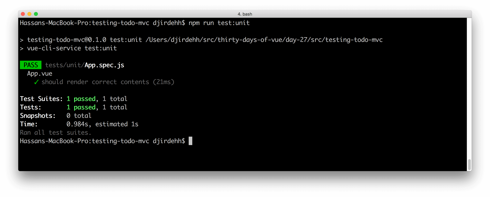
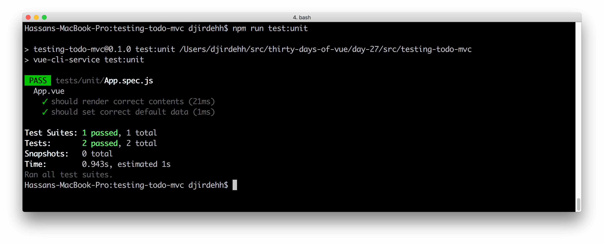

# Testing the App

Yesterday, we discussed the simplified [TodoMVC](http://todomvc.com/) app that we hope to test and established the test file where we’ll be running our tests. Today, we’ll start by looking at two features of our application and think about how we’ll create suitable test assertions for them.


We'll essentially want to test any dynamic logic we have in our component. For simplicity, however, we’ll begin by setting up our first assertions to verify our app is initialized with the correct static content and data.

We like to start out testing by listing our assumptions about a component and under what circumstances these assumptions are true. For instance, our first tests will have these list of assumptions:

- Under all circumstances, we can assume there will be a title with the text content of ‘todos’.
- Under all circumstances, we can assume there will be an input with the placeholder text content of ‘What needs to be done?’.
- Under all circumstances, we can assume our component will initialize the `todos` and `todoItem` data properties with an empty array and a blank string respectively.

These _assumptions_ will translate into the tests we write.

I> Since these initial assumptions are simple enough and don’t involve any dynamic logic, they may actually not warrant the need to have tests. However, we’ll begin with these tests/assumptions since they’ll pose to be a gradual and easy introduction.

## Testing

Let's open the file `tests/unit/App.spec.js`. We left off with some dummy tests in this file, so let's clear those off and start with a fresh `describe` block:

```javascript
describe('App', () => {
  // Tests go here
});
```

For the upcoming tests that we want to write, we'll want to import and bring in the `vue` library into our test file:

```javascript
import Vue from "vue";

describe('App', () => {
  // Tests go here
});
```

Since we’re testing the `App` component, we'll want to bring that into our workspace as well:

```javascript
import Vue from "vue";
import App from "@/App";

describe('App', () => {
  // Tests go here
});
```

> The Webpack configuration of the Vue CLI scaffolded project resolves the `@` symbol to import relatively from `src` anywhere in our project.

Let's write our first test. Our first test will cover the first two assumptions listed above - the header title and input should have the correct initial text content and placeholder respectively.

```javascript
import Vue from "vue";
import App from "@/App";

describe('App', () => {
  it('should render correct contents', () => {
    // our assertion will go here
  });
});
```

Since we'll be asserting the rendered DOM within this particular test, we'll need to have our component be in the __mounted__ state. There are a few ways of achieving this but one way would involve first extending the `App` module like so:

```javascript
import Vue from "vue";
import App from "@/App";

describe('App', () => {
  it('should render correct contents', () => {
    const Constructor = Vue.extend(App);
  });
});
```

`Vue.extend()` is the internal Vue method that is called when a component is created with `Vue.component()`. Unlike `Vue.component()`, `Vue.extend()` _doesn’t_ associate the created constructor with a string ID (i.e. the name of the component).

With our constructor extended, we can now mount our component with the `$mount()` method:

```javascript
import Vue from "vue";
import App from "@/App";

describe('App', () => {
  it('should render correct contents', () => {
    const Constructor = Vue.extend(App);
    const vm = new Constructor().$mount();
  });
});
```

`vm` will now reference the mounted component that we can use to access the rendered HTML. The component’s HTML can be accessed with `vm.$el`. With the component's HTML available to us, we’ll use the standard JavaScript [`querySelector()`](https://developer.mozilla.org/en-US/docs/Web/API/Document/querySelector) method to return the appropriate elements and assert their text content and placeholder.

```javascript
import Vue from "vue";
import App from "@/App";

describe('App', () => {
  it('should render correct contents', () => {
    const Constructor = Vue.extend(App);
    const vm = new Constructor().$mount();

    expect(vm.$el.querySelector(".title").textContent).toBe("todos");
    expect(vm.$el.querySelector(".new-todo").placeholder).toBe(
      "What needs to be done?"
    );
  });
});
```

With that, our tests should pass. As a reminder, we can run all the tests in our project with the `test:unit` script.

```shell
npm run test:unit
```



The second test we wish to create is the assertion that the `App` component is initialized with the correct initial data - `todos` is an empty array and `newTodo` is a blank string. This test will be easier to conduct since we _don’t_ need our component to be in the mounted state.

If we recall from an earlier article in this course, we’ve mentioned that in components the `data` property must be a _function_ that returns an object of key-value pairs. We can access this component data by simply invoking the said function. For this test, we’ll create another `it` block with the test description of `'should set correct default data'`:

{lang=javascript,line-numbers=off}
<<[src/testing-todo-mvc/tests/unit/App.spec.js](./src/testing-todo-mvc/tests/unit/App.spec.js)

By running our test suite, we should expect to see both tests pass.

```shell
npm run test:unit
```



Though everything we’ve done works well, things would start to become a little more difficult when we find ourselves needing to assert more complicated functionality (e.g. assert that when the user enters an input and clicks the remove icon, the todo item is removed from the list).

This is where the official Vue testing library, [__Vue Test Utils__](https://vue-test-utils.vuejs.org/), comes in. __Vue Test Utils__ provides an easier and higher-level interface for asserting against a Vue component under test. We'll refactor the tests we've written and compile a few a more assertions, all with the __Vue Test Utils__ library, tomorrow!
